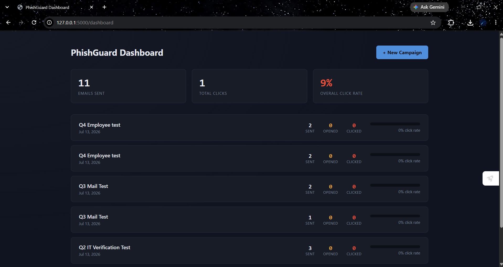
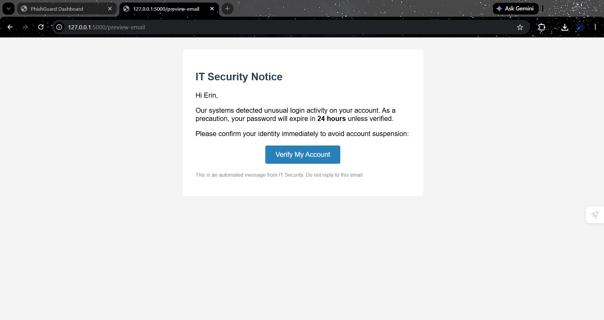
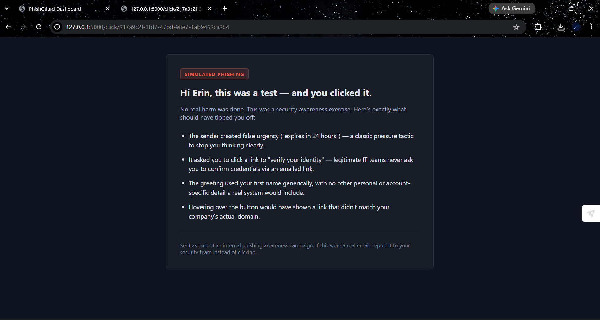
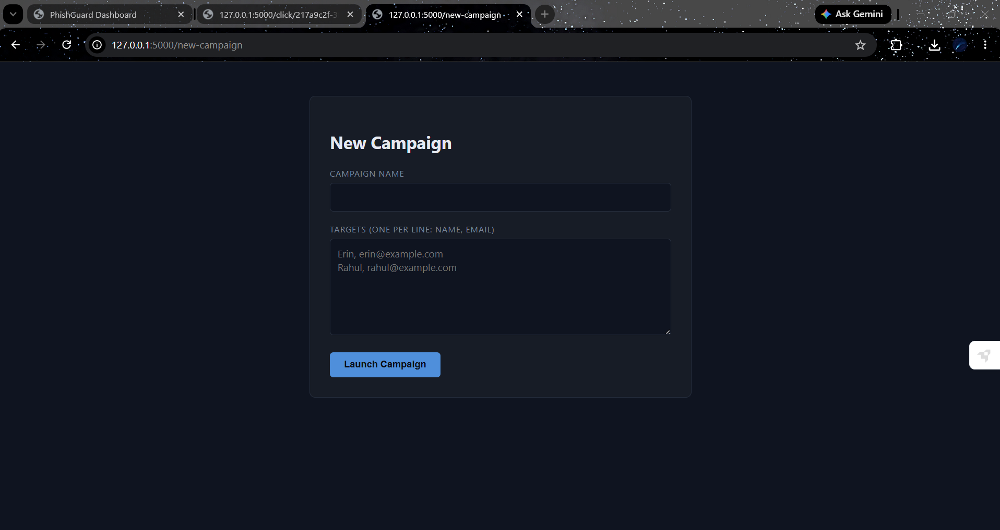

# PhishGuard

**A self-hosted phishing simulation platform that teaches the moment someone clicks — not after.**

PhishGuard lets a security team run realistic, controlled phishing campaigns against their own organization: send a convincing fake email, silently track who opens and clicks it via unique per-recipient tokens, and — the moment someone falls for it — redirect them straight into a specific, personalized breakdown of exactly what gave the email away. No fake login forms, no credential capture. Just the click, and the lesson.

> Phishing remains one of the most common initial-access vectors in real breaches. The best way to build resistance to it isn't a slide deck — it's a safe, realistic simulation, followed by immediate, specific feedback.

---
## 📸 Screenshots

| Campaign Dashboard | Simulated Phishing Email |
|---|---|
|  |  |

| Awareness / "Gotcha" Page | New Campaign Form |
|---|---|
|  |  |

---
## Why this exists

Most phishing awareness training happens in a slideshow, days or weeks removed from anything real. It doesn't stick. PhishGuard is built on a different premise: the most effective moment to teach someone what a phishing email looks like is **immediately after they've clicked one** — while it's fresh, specific, and personal, not abstract.

This project is a small, from-scratch clone of the same idea behind real tools like GoPhish and KnowBe4, built to understand — not just use — how phishing simulation platforms actually work under the hood: token-based tracking, email templating, and campaign analytics.

## How it works

```
1. Admin creates a campaign  →  picks targets, launches
2. Each target receives a personalized email with a unique hidden token
3. Email opened  →  invisible tracking pixel silently logs "opened"
4. Link clicked  →  unique token identifies exactly who, logs "clicked"
5. Instead of a fake login page, the click leads straight to a
   personalized awareness page: "here's exactly what gave this away"
6. Dashboard aggregates sent / opened / clicked across every campaign
```

The core trick that makes it all work: every recipient gets a **unique token** embedded in their tracking link and pixel (e.g. `/click/217a9c2f-...`). That token — generated per-event and stored in the database — is what lets the app know *exactly* who opened or clicked, without ever asking them to log in or identify themselves.

## Features

- **Realistic HTML email templates**, rendered per-recipient with Jinja2
- **Token-based open + click tracking** — an invisible tracking pixel for opens, a unique redirect link for clicks
- **Instant awareness page** — no fake credential harvesting; clicking leads straight into specific, template-matched feedback on the red flags that were present
- **Multi-target campaign creation** via a simple form — add any number of targets, launch in one action
- **Local SMTP sending** — real, fully-formed MIME emails, sent through a local debug mail server so nothing ever leaves your machine during development
- **Analytics dashboard** — sent / opened / clicked counts and click-rate per campaign, with duplicate-safe counting (a person clicking the same link twice only counts once)
- **Demo mode** — the publicly deployed version logs sends instead of dispatching them, so the live demo is safe to leave running

## Tech stack

- **Backend:** Python, Flask
- **Database:** SQLite via Flask-SQLAlchemy (Target / Campaign / Event relational model)
- **Templating:** Jinja2
- **Mail:** Python `smtplib` + `aiosmtpd` (local dev), MIME-formatted messages
- **Frontend:** Plain HTML/CSS/JS — no framework, deliberately kept dependency-light

## Data model

```
Target        Campaign         Event
──────        ────────         ─────
id             id                id
name           name              token (unique per event)
email          template_name     target_id   → FK
               created_at        campaign_id → FK
                                  event_type  (sent / opened / clicked)
                                  timestamp
```

Every action (sent, opened, clicked) is logged as its own `Event` row rather than overwriting a single status field — this preserves a full timeline per person, per campaign, rather than just a final snapshot.

## Running it locally

```bash
git clone https://github.com/Erin131/phishguard-sim.git
cd phishguard-sim
python -m venv venv
venv\Scripts\activate        # Windows
# source venv/bin/activate   # macOS/Linux

pip install -r requirements.txt
python init_db.py
python app.py
```

In a second terminal, start the local mail catcher so sent emails have somewhere to land:

```bash
pip install aiosmtpd
python -m aiosmtpd -n -l localhost:1025
```

Then visit:
- `http://127.0.0.1:5000/new-campaign` — launch a campaign
- `http://127.0.0.1:5000/dashboard` — view results

## Ethical design notes

This was a deliberate constraint throughout the build, not an afterthought:

- **No credential harvesting, ever.** Clicking a simulated link never shows a fake login form. The goal is education, not data collection.
- **No real external sending** on the public deployment — demo mode replaces actual dispatch with logging.
- **Campaign creation is password-gated** to prevent the public demo from being used to target arbitrary real email addresses.

## Possible extensions

- Additional email templates (HR document share, delivery notification, executive impersonation) beyond the current IT-reset scenario
- Per-target detail view within a campaign (not just aggregate counts)
- CSV export of campaign results
- Scheduled/recurring campaigns

## Background

Built as a from-scratch rebuild of an earlier phishing simulation project, this version focuses on a cleaner architecture and a genuinely usable, aesthetic dashboard — part of an ongoing portfolio of security tooling projects.